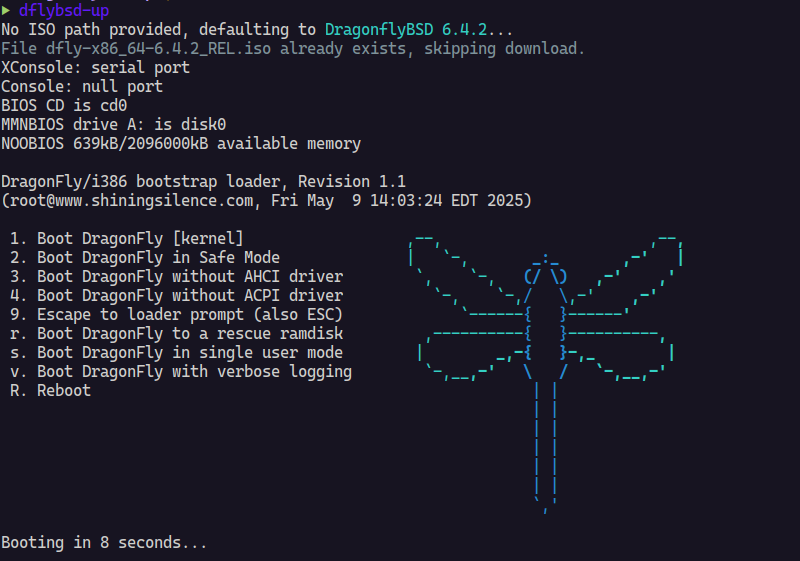

# dflybsd-up ≽༏≼

A convenient CLI tool to quickly spin up DragonflyBSD virtual machines using
QEMU with sensible defaults.



## ✨ Features

- **⚡ Quick Start**: Launch DragonflyBSD with a single command
- **📥 Automatic ISO Download**: Fetches DragonflyBSD ISO images automatically
  from official mirrors
- **🔢 Version Support**: Specify any DragonflyBSD version (defaults to 6.4.2)
- **🎯 Flexible Input**: Accepts version numbers, local ISO paths, or download
  URLs
- **💾 Smart Caching**: Skips re-downloading already downloaded ISOs
- **🚀 KVM Acceleration**: Leverages KVM for optimal performance
- **🔌 SSH Port Forwarding**: Automatically forwards port 2222 to guest port 22
- **💻 Serial Console**: Direct terminal access without graphical overhead
- **💿 Persistent Storage**: Optional disk image support for persistent
  installations
- **⚙️ Customizable Resources**: Configure CPU, memory, and disk settings
- **🗃️ VM Management**: Track and manage multiple virtual machines with database
  storage
- **🌐 Bridge Networking**: Support for bridge networking configurations
- **🔍 VM Inspection**: List, start, stop, and inspect virtual machines
- **🏷️ Automatic MAC Assignment**: Unique MAC addresses generated for each VM

## 📋 Prerequisites

- [Deno](https://deno.com) runtime
- QEMU with KVM support (`qemu-system-x86_64`)
- KVM kernel modules enabled

## 📦 Installation

```bash
deno install -A -g -r -f --config deno.json ./main.ts -n dflybsd-up
```

## 🚀 Usage

### Basic Usage

```bash
# Launch with defaults (DragonflyBSD 6.4.2, 2 CPUs, 2GB RAM)
dflybsd-up

# Specify a version (automatically downloads the RELEASE ISO)
dflybsd-up 6.4.2

# Use a local ISO file
dflybsd-up /path/to/dragonflybsd.iso

# Download from a specific URL
dflybsd-up https://mirror-master.dragonflybsd.org/iso-images/dfly-x86_64-6.4.2_REL.iso
```

### Advanced Options

```bash
# Custom CPU and memory configuration
dflybsd-up --cpu host --cpus 4 --memory 4G

# Specify output path for downloaded ISO
dflybsd-up 6.4.2 --output ~/isos/dragonfly.iso

# Use a persistent disk image with custom size
dflybsd-up --drive dragonfly.img --disk-format raw --size 30G

# Use bridge networking
dflybsd-up --bridge br0

# Combine options
dflybsd-up 6.4.2 \
  --cpus 4 \
  --memory 8G \
  --drive dragonfly.qcow2 \
  --disk-format qcow2 \
  --size 50G \
  --bridge br0
```

### VM Management Commands

```bash
# List running virtual machines
dflybsd-up ps

# List all virtual machines (including stopped)
dflybsd-up ps --all

# Start a previously created VM
dflybsd-up start my-vm

# Stop a running VM
dflybsd-up stop my-vm

# Inspect VM details
dflybsd-up inspect my-vm
```

## ⚙️ Options

| Option          | Short | Description                          | Default                 |
| --------------- | ----- | ------------------------------------ | ----------------------- |
| `--output`      | `-o`  | Output path for downloaded ISO       | Auto-generated from URL |
| `--cpu`         | `-c`  | CPU type to emulate                  | `host`                  |
| `--cpus`        | `-C`  | Number of CPU cores                  | `2`                     |
| `--memory`      | `-m`  | Amount of memory for VM              | `2G`                    |
| `--drive`       | `-d`  | Path to VM disk image                | None                    |
| `--disk-format` |       | Disk image format (qcow2, raw, etc.) | `raw`                   |
| `--size`        |       | Size of disk image to create         | `20G`                   |
| `--bridge`      | `-b`  | Network bridge name for networking   | None (uses NAT)         |

## 🔢 Version Format

Simply provide the version number (e.g., `6.4.2` or `6.2`), and the tool will
automatically construct the download URL for the corresponding RELEASE ISO.

Examples:

- `6.4.2` → downloads `dfly-x86_64-6.4.2_REL.iso`
- `6.2` → downloads `dfly-x86_64-6.2_REL.iso`
- `7.0` → downloads `dfly-x86_64-7.0_REL.iso`

## 🖥️ Console Setup

When DragonflyBSD boots, you'll see the boot menu. For the best experience with
the serial console:

1. **Select option `9. Escape to loader prompt (also ESC)`**
2. **Configure console output:**
   ```
   set console=comconsole
   boot
   ```

This enables proper console redirection to your terminal.

## �️ Virtual Machine Management

The tool now includes database-backed VM management, allowing you to track and manage multiple virtual machines:

### VM Lifecycle

- **Automatic Tracking**: Each VM is assigned a unique name and tracked in a local SQLite database
- **Persistent State**: VM configurations are preserved between sessions
- **Status Monitoring**: Track running and stopped VMs with process IDs
- **Resource Information**: View CPU, memory, and disk configurations for each VM

### VM Commands

- `ps` - List virtual machines (use `--all` to include stopped VMs)
- `start <vm-name>` - Start a previously created VM
- `stop <vm-name>` - Stop a running VM
- `inspect <vm-name>` - View detailed VM information

## 🌐 Networking Options

### Default NAT Networking
By default, VMs use QEMU's user-mode networking with port forwarding:
- Host port 2222 → Guest port 22 (SSH)
- No additional configuration required
- Works without root privileges

### Bridge Networking
For more advanced networking scenarios, use bridge networking:

```bash
# Use an existing bridge
dflybsd-up --bridge br0

# The tool will create the bridge if it doesn't exist (requires sudo)
```

Benefits of bridge networking:
- VMs get IP addresses on your local network
- Direct network access without port forwarding
- Better performance for network-intensive applications
- Supports multiple VMs on the same network segment

## �💿 Creating a Persistent Disk

To install DragonflyBSD persistently:

```bash
# Create a disk image (done automatically with --drive if image doesn't exist)
dflybsd-up 6.4.2 --drive dragonfly.qcow2 --disk-format qcow2 --size 30G

# Or manually create with qemu-img
qemu-img create -f qcow2 dragonfly.qcow2 20G

# Launch with the disk attached
dflybsd-up 6.4.2 --drive dragonfly.qcow2 --disk-format qcow2
```

## 🔐 SSH Access

### NAT Networking (Default)
The VM automatically forwards host port 2222 to guest port 22. After configuring SSH in your DragonflyBSD installation:

```bash
ssh -p 2222 user@localhost
```

### Bridge Networking
With bridge networking, the VM gets its own IP address on your network. You can SSH directly to the VM's IP:

```bash
ssh user@<vm-ip-address>
```

## 📄 License

See [LICENSE](LICENSE) file for details.

## 🤝 Contributing

Contributions are welcome! Please feel free to submit issues or pull requests.

> [!NOTE]
>
> This tool is designed for development and testing purposes. For production
> DragonflyBSD deployments, consider using proper installation methods.
